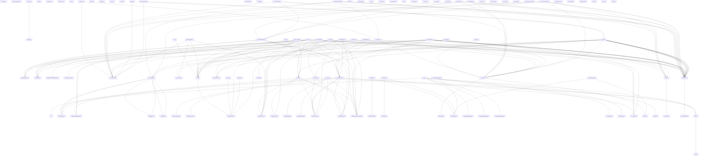

# Call Graph for Controller.vy

```mermaid
%%{init: {
  "flowchart": {
    "nodeSpacing": 100,
    "rankSpacing": 800
  }
}}%%
flowchart TD
    N0["A"]
    N1["AMM.active_band"]
    N2["AMM.active_band_with_skip"]
    N3["AMM.bands_x"]
    N4["AMM.bands_y"]
    N5["AMM.can_skip_bands"]
    N6["AMM.deposit_range"]
    N7["AMM.get_base_price"]
    N8["AMM.get_p"]
    N9["AMM.get_rate_mul"]
    N10["AMM.get_sum_xy"]
    N11["AMM.get_x_down"]
    N12["AMM.has_liquidity"]
    N13["AMM.p_oracle_down"]
    N14["AMM.p_oracle_up"]
    N15["AMM.price_oracle"]
    N16["AMM.read_user_tick_numbers"]
    N17["AMM.set_callback"]
    N18["AMM.set_fee"]
    N19["AMM.set_rate"]
    N20["AMM.withdraw"]
    N21["BORROWED_TOKEN.balanceOf"]
    N22["FACTORY.admin"]
    N23["FACTORY.fee_receiver"]
    N24["__init__"]
    N25["_add_collateral_borrow"]
    N26["_borrowed_token.approve"]
    N27["_borrowed_token.decimals"]
    N28["_calculate_debt_n1"]
    N29["_check_approval"]
    N30["_collateral_token.decimals"]
    N31["_create_loan"]
    N32["_debt"]
    N33["_get_f_remove"]
    N34["_health"]
    N35["_liquidate"]
    N36["_log_2"]
    N37["_remove_from_list"]
    N38["_save_rate"]
    N39["active_band"]
    N40["active_band_with_skip"]
    N41["add_collateral"]
    N42["admin"]
    N43["admin_fees"]
    N44["admin_fees_x"]
    N45["admin_fees_y"]
    N46["amm"]
    N47["amm_price"]
    N48["approve"]
    N49["balanceOf"]
    N50["bands_x"]
    N51["bands_y"]
    N52["borrow_more"]
    N53["borrow_more_extended"]
    N54["borrowed_token"]
    N55["calculate_debt_n1"]
    N56["can_skip_bands"]
    N57["check_lock"]
    N58["collateral_token"]
    N59["collect_fees"]
    N60["create_loan"]
    N61["create_loan_extended"]
    N62["debt"]
    N63["decimals"]
    N64["deposit_range"]
    N65["execute_callback"]
    N66["factory"]
    N67["fee_receiver"]
    N68["get_base_price"]
    N69["get_p"]
    N70["get_rate_mul"]
    N71["get_sum_xy"]
    N72["get_x_down"]
    N73["get_y_effective"]
    N74["has_liquidity"]
    N75["health"]
    N76["health_calculator"]
    N77["liquidate"]
    N78["liquidate_extended"]
    N79["loan_exists"]
    N80["max_borrowable"]
    N81["max_p_base"]
    N82["min_collateral"]
    N83["out.append"]
    N84["p_oracle_down"]
    N85["p_oracle_up"]
    N86["price_oracle"]
    N87["rate_write"]
    N88["read_user_tick_numbers"]
    N89["remove_collateral"]
    N90["repay"]
    N91["repay_extended"]
    N92["reset_admin_fees"]
    N93["save_rate"]
    N94["set_admin_fee"]
    N95["set_amm_fee"]
    N96["set_borrowing_discounts"]
    N97["set_callback"]
    N98["set_extra_health"]
    N99["set_fee"]
    N100["set_monetary_policy"]
    N101["set_rate"]
    N102["stablecoin"]
    N103["token.transfer"]
    N104["token.transferFrom"]
    N105["tokens_to_liquidate"]
    N106["total_debt"]
    N107["transfer"]
    N108["transferFrom"]
    N109["user_prices"]
    N110["user_state"]
    N111["users_to_liquidate"]
    N112["wad_ln"]
    N113["withdraw"]
    N97 --> N22
    N97 --> N17
    N108 --> N104
    N107 --> N103
    N24 --> N0
    N24 --> N112
    N24 --> N58
    N24 --> N54
    N24 --> N102
    N24 --> N30
    N24 --> N27
    N24 --> N26
    N112 --> N36
    N38 --> N87
    N38 --> N19
    N93 --> N38
    N32 --> N9
    N62 --> N32
    N106 --> N9
    N28 --> N1
    N28 --> N14
    N28 --> N73
    N28 --> N112
    N28 --> N5
    N28 --> N14
    N28 --> N15
    N81 --> N15
    N81 --> N112
    N81 --> N7
    N81 --> N2
    N81 --> N14
    N80 --> N73
    N80 --> N81
    N80 --> N21
    N82 --> N81
    N82 --> N73
    N55 --> N28
    N65 --> N1
    N65 --> N3
    N65 --> N4
    N65 --> N1
    N65 --> N3
    N65 --> N4
    N31 --> N28
    N31 --> N9
    N31 --> N6
    N31 --> N108
    N31 --> N107
    N31 --> N38
    N60 --> N29
    N60 --> N31
    N61 --> N29
    N61 --> N107
    N61 --> N65
    N61 --> N31
    N61 --> N108
    N61 --> N108
    N25 --> N32
    N25 --> N16
    N25 --> N20
    N25 --> N15
    N25 --> N28
    N25 --> N6
    N41 --> N25
    N41 --> N108
    N41 --> N38
    N89 --> N29
    N89 --> N25
    N89 --> N108
    N89 --> N38
    N52 --> N29
    N52 --> N25
    N52 --> N108
    N52 --> N107
    N52 --> N38
    N53 --> N29
    N53 --> N107
    N53 --> N65
    N53 --> N25
    N53 --> N108
    N53 --> N108
    N53 --> N38
    N90 --> N32
    N90 --> N29
    N90 --> N20
    N90 --> N108
    N90 --> N108
    N90 --> N37
    N90 --> N2
    N90 --> N16
    N90 --> N20
    N90 --> N28
    N90 --> N6
    N90 --> N34
    N90 --> N108
    N90 --> N38
    N91 --> N29
    N91 --> N16
    N91 --> N20
    N91 --> N32
    N91 --> N108
    N91 --> N65
    N91 --> N37
    N91 --> N108
    N91 --> N108
    N91 --> N107
    N91 --> N108
    N91 --> N28
    N91 --> N6
    N91 --> N108
    N91 --> N108
    N91 --> N38
    N34 --> N11
    N34 --> N16
    N34 --> N1
    N34 --> N15
    N34 --> N14
    N34 --> N10
    N76 --> N16
    N76 --> N32
    N76 --> N2
    N76 --> N10
    N76 --> N28
    N76 --> N11
    N76 --> N14
    N76 --> N73
    N76 --> N15
    N35 --> N32
    N35 --> N34
    N35 --> N20
    N35 --> N33
    N35 --> N108
    N35 --> N108
    N35 --> N108
    N35 --> N108
    N35 --> N65
    N35 --> N108
    N35 --> N108
    N35 --> N108
    N35 --> N108
    N35 --> N108
    N35 --> N37
    N35 --> N38
    N77 --> N29
    N77 --> N35
    N78 --> N29
    N78 --> N35
    N105 --> N29
    N105 --> N10
    N105 --> N33
    N105 --> N32
    N75 --> N34
    N75 --> N32
    N111 --> N32
    N111 --> N34
    N111 --> N10
    N111 --> N83
    N47 --> N8
    N109 --> N12
    N109 --> N16
    N109 --> N14
    N109 --> N13
    N110 --> N10
    N110 --> N16
    N110 --> N32
    N95 --> N22
    N95 --> N18
    N100 --> N22
    N100 --> N87
    N96 --> N22
    N43 --> N9
    N59 --> N23
    N59 --> N9
    N59 --> N38
    N59 --> N107
```
