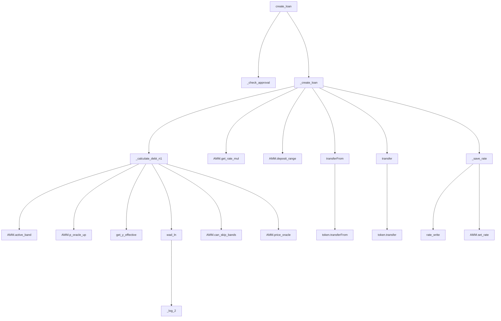

# Call Graph for create_loan function

```mermaid
%%{init: {
  "flowchart": {
    "nodeSpacing": 100,
    "rankSpacing": 350
  }
}}%%
flowchart TD
    N0["AMM.active_band"]
    N1["AMM.can_skip_bands"]
    N2["AMM.deposit_range"]
    N3["AMM.get_rate_mul"]
    N4["AMM.p_oracle_up"]
    N5["AMM.price_oracle"]
    N6["AMM.set_rate"]
    N7["_calculate_debt_n1"]
    N8["_check_approval"]
    N9["_create_loan"]
    N10["_log_2"]
    N11["_save_rate"]
    N12["create_loan"]
    N13["get_y_effective"]
    N14["rate_write"]
    N15["token.transfer"]
    N16["token.transferFrom"]
    N17["transfer"]
    N18["transferFrom"]
    N19["wad_ln"]
    N12 --> N8
    N12 --> N9
    N9 --> N7
    N9 --> N3
    N9 --> N2
    N9 --> N18
    N9 --> N17
    N9 --> N11
    N7 --> N0
    N7 --> N4
    N7 --> N13
    N7 --> N19
    N7 --> N1
    N7 --> N5
    N19 --> N10
    N18 --> N16
    N17 --> N15
    N11 --> N14
    N11 --> N6
```
