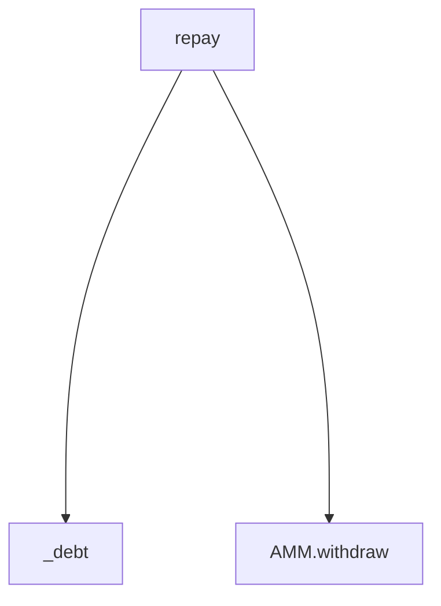

# Quick Start

This guide will help you get up and running with Natrix quickly.

## Prerequisites

- Python (version 3.10 or higher)

## Installation

You can install Natrix using various package managers:

=== "pip"

    ```bash
    pip install natrix
    ```

=== "uv"

    ```bash
    uv add natrix
    ```

=== "poetry"
    ```bash
    poetry add natrix
    ```

## Usage

To analyze a Vyper contract:

```bash
natrix lint path/to/your/contract.vy
# or simply
natrix path/to/your/contract.vy
```

You can also analyze multiple files at once:

```bash
natrix lint path/to/contracts/
# or simply
natrix path/to/contracts/
```

### Code Generation

Natrix includes code generation utilities to help with various tasks:

#### Generate Explicit Exports

Generate explicit exports for a contract to fix the implicit export warning:

```bash
natrix codegen exports path/to/your/contract.vy
```

#### Generate Call Graph

Visualize the function call relationships in your contract using Mermaid diagrams:

```bash
# Generate call graph for entire contract
natrix codegen call_graph path/to/your/contract.vy

# Generate call graph for a specific function and its dependencies
natrix codegen call_graph path/to/your/contract.vy:function_name
```

The call graph generator will output a Mermaid diagram that shows:
- All functions in your contract
- Which functions call which other functions
- External calls to other contracts (e.g., `AMM.withdraw`)

Example output:


You can copy this output to any Mermaid-compatible viewer to visualize your contract's structure.

## Integration with pre-commit

You can use Natrix with [pre-commit](https://pre-commit.com/) to automatically lint your Vyper files before each commit.

1. Add a `.pre-commit-config.yaml` file to your project with the following content:

```yaml
repos:
- repo: https://github.com/AlbertoCentonze/natrix
rev: v0.1.9  # Use the latest version
hooks:
    - id: natrix
```

2. Install the hooks:

```bash
pre-commit install
```

## Next Steps

- For advanced configuration options, see the [Configuration](./configuration.md) guide
- Explore the available [Rules](./rules/index.md) to understand what Natrix can check for
- Learn more about [Development](./development/index.md) if you want to contribute
